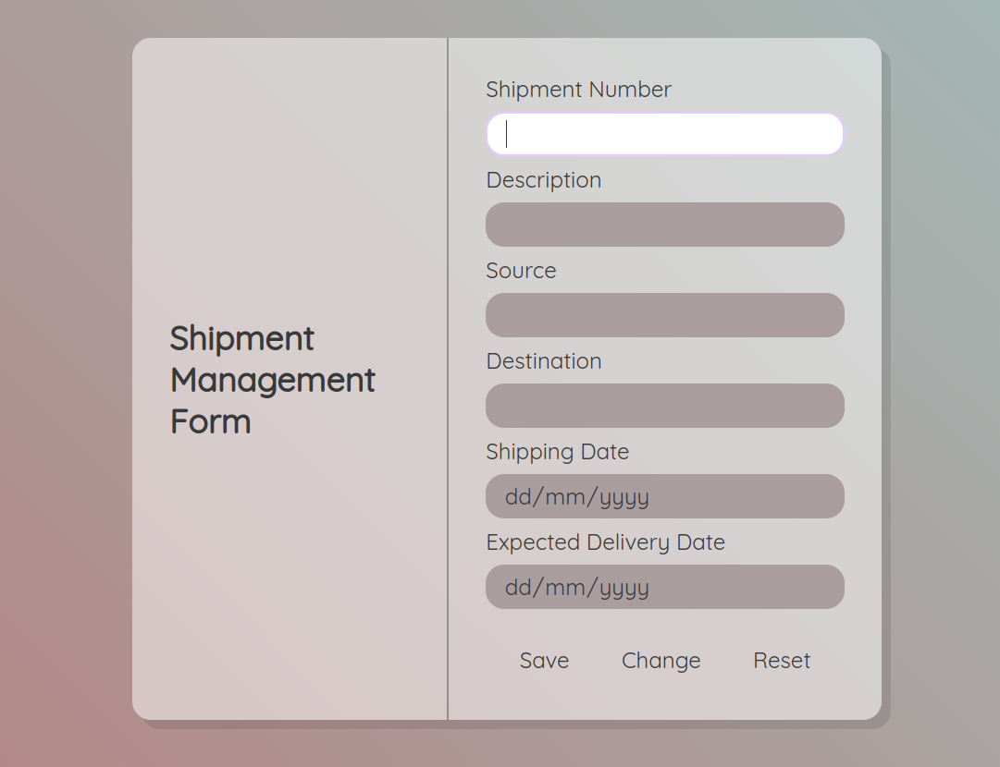

# Shipment Management Form 📝

> A simple form using HTML, CSS and JavaScript with JsonPowerDB as a backend to store and retrieve data!

This form has been created to demonstrate the working of JPDB.

## JPDB

JSONPowerDB is a High Performance, Light Weight, Ajax Enabled, Serverless, Simple to Use, Real-time Database. Easy and fast to develop database applications without using any server side programming / scripting or without installing any kind of database.

It is basically a Database Server with Developer friendly REST API services.

JPDB has ready to use API for Json document DB, RDBMS, Key-value DB, GeoSpatial DB and Time Series DB functionality. JPDB supports and advocates for true serverless and pluggable API development.

Documentation Link --> https://login2explore.com/jpdb/docs.html#jpdb-command-request

## Benefits of using JPDB

1. It is realtime and simple to use.
2. Easy to maintain the reconds.
3. Serverless support - fast development - cuts time to market.
4. Build using world's fastest indexing engine PowerIndex which gives unlimited data capacity, supporting unlimited indexes, realtime data processing which makes it fast and secure.
5. Give developer friendly Webservices API which reduce the developement cost.
6. Multiple Security Layers.
7. Schema free - easy to maintain
8. A single instance - Million Indexes
9. Inbuilt support for querying multiple databases.
10. It is light weight.
11. It is a serverless database so that you don't have to choose an instance size at all.

## Screenshot

## Installation

Just include following scripts in your head tag and you are good to go:

1. 
2. 

## Usage

1. Enter the Shipment Number and press Tab.
2. If a shipment with the mentioned number exists, its details will be autofilled to be changed.
3. Otherwise the fields will be unlocked to allow for entry of new data.

## Release History

- 0.0.1
  - First working version created! Trying to get some more features in!

## Meta

Mohit Kumar Gupta – [@mhtgupta281](https://twitter.com/mhtgupta281) – mhtgupta281@gmail.com

[https://github.com/coldcoffeee/login2explore](https://github.com/coldcoffeee/login2explore/)
